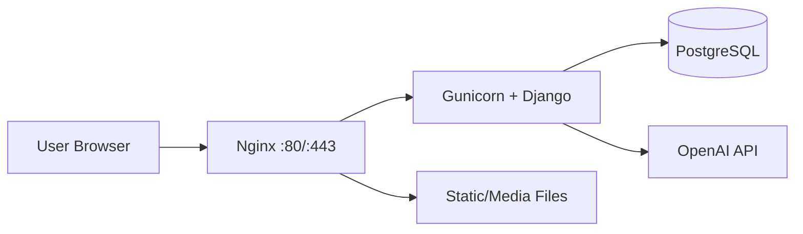

# 🚀 MZKI Informatica

A complete [web platform](https://mzki.com.br) for technology education and digital inclusion.

## 📋 About the Project

**MZKI Informatica** is a full web platform developed for a school focused on technology and digital inclusion.

The project includes:

- 🏠 Institutional website with responsive pages
- 👥 Full student and user management
- 📚 Learning materials and media support
- 💬 Contact forms and email integration
- 🤖 AI-powered course recommendation system
- 🔐 Authenticated area with progress tracking

## ✨ Main Features

### 🎯 Core System

- Responsive and modern institutional pages
- Full user authentication and profile management
- Administrative dashboard
- Contact and lead capture forms
- Media upload and content management

### 🤖 AI Assistant

- AI course recommendation engine using OpenAI + LangChain
- Context-aware suggestions based on user profile
- Conversation history support

### 🐳 Production Deployment

- Dockerized stack (`web`, `db`, `nginx`)
- HTTPS with Let’s Encrypt certificates
- PostgreSQL as the production database
- Static and media files served by Nginx

## 🏗️ Project Architecture

### Stack

- **Backend:** Django 6
- **Database:** PostgreSQL (production) / SQLite (development)
- **Frontend:** HTML + CSS + JavaScript + Django Templates
- **AI Integration:** LangChain + OpenAI
- **Server:** Gunicorn + Nginx
- **Containerization:** Docker + Docker Compose

### Service Diagram



## 📁 Directory Structure

```text
mzkiInformatica/
├── mzkiInformatica/          # Django project settings
├── app/                      # Main application
├── docs/deploy/              # Deployment templates and scripts
├── static/                   # Static files
├── media/                    # Uploaded files
├── docker-compose.yml        # Container orchestration
├── Dockerfile                # Web image build file
├── install.sh                # Installation script
└── README.md
```

## ⚙️ Installation and Setup

### 1) Clone the repository

```bash
git clone <your-repo-url>
cd mzkiInformatica
```

### 2) Configure environment variables

Create a `.env` file in the project root:

```env
DEBUG=False
SECRET_KEY=your-secret-key
OPENAI_API_KEY=your-openai-key
LANGCHAIN_API_KEY=your-langchain-key
DATABASE_URL=postgresql://postgres:postgres@db:5432/mzki_db
EMAIL_HOST=smtp.gmail.com
EMAIL_PORT=587
EMAIL_HOST_USER=your@email.com
EMAIL_HOST_PASSWORD=your-app-password
DEFAULT_FROM_EMAIL=noreply@yourdomain.com
```

### 3) Start services with Docker

```bash
docker compose up -d --build
```

### 4) Run migrations and create admin user

```bash
docker compose exec web python manage.py migrate
docker compose exec web python manage.py createsuperuser
```

## 🌐 Production Deployment

### Deploy flow

1. Configure DNS records to point to your VPS
2. Prepare `.env` with production values
3. Run `install.sh` on the server
4. Start containers with Docker Compose
5. Issue certificates with Certbot
6. Reload Nginx and validate HTTPS

### Useful commands

```bash
# Check logs
docker compose logs -f web
docker compose logs -f nginx
docker compose logs -f db

# Restart services
docker compose restart

# Rebuild web image
docker compose build --no-cache web && docker compose up -d

# Enter web container
docker compose exec web bash
```

## 🔒 Security Notes

- Keep `.env` out of version control
- Rotate leaked API keys immediately
- Use strong values for `SECRET_KEY`
- Restrict `ALLOWED_HOSTS` to real domains
- Force HTTPS in production

## 🧪 Testing

Run tests inside the web container:

```bash
docker compose exec web python manage.py test
```

## 🛠️ Troubleshooting

### Database connection issues

- Check if `db` container is healthy
- Validate `DATABASE_URL` in `.env`
- Re-run migrations

### Nginx / HTTPS issues

- Validate Nginx config syntax
- Check mounted certificate paths
- Ensure ports `80` and `443` are open

### Build or disk issues

- Use CPU-only ML dependencies when possible
- Prune unused Docker images/layers
- Monitor disk usage before rebuilds

## 📌 Recent Improvements

- Docker deployment standardized with `web/db/nginx`
- Django production settings hardened
- Template loader conflict fixed (`APP_DIRS=False` with custom loaders)
- Nginx HTTPS configuration corrected
- Duplicate ACME location removed
- Build size reduced with CPU-only Torch wheels

## 👨‍💻 Author

Developed by **Thiago Mizuki**  
Project: **MZKI Informatica**

## 📄 License

This project is private and intended for internal/business use unless explicitly stated otherwise.
